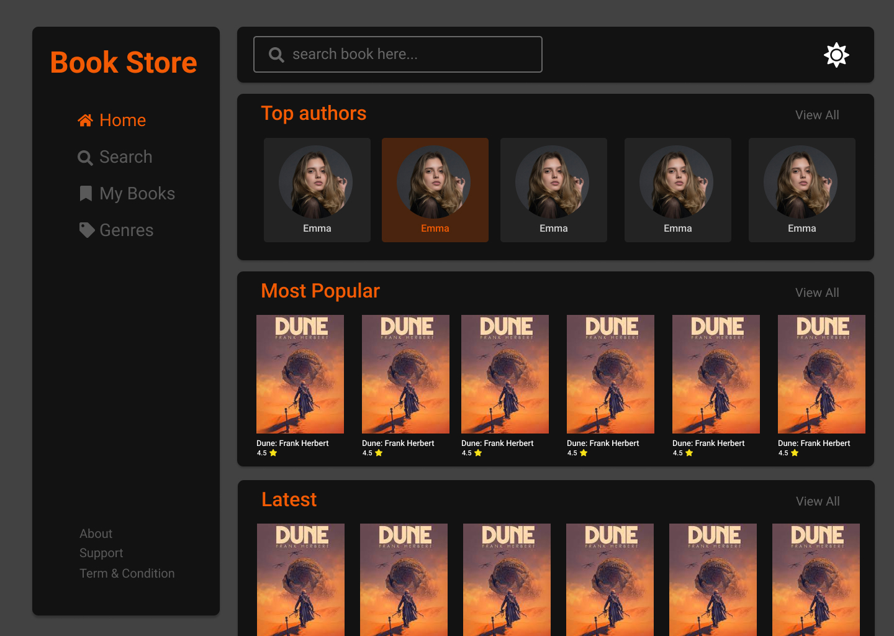
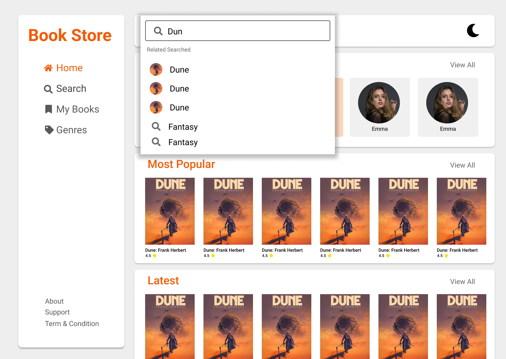

# VBookstore MERN Stack Web Application Documentation

[](https://www.linkedin.com/in/ebaneshar-vedharaj-422566214)

## Introduction
Welcome to the documentation for our Bookstore MERN (MongoDB, Express.js, React, Node.js) stack web application. This application allows users to browse, search, and purchase books online.

### Technologies Used
- MongoDB
- Express.js
- React
- Node.js

## Installation
To run the application locally, follow these steps:

1. Clone the repository from GitHub:

   ```
   git clone https://github.com/yourusername/bookstore.git
   ```

2. Navigate into the project directory:

   ```
   cd bookstore
   ```

3. Install backend dependencies:

   ```
   cd server
   npm install
   ```

4. Install frontend dependencies:

   ```
   cd ../client
   npm run dev
   ```

5. Start the backend server:

   ```
   cd ../server
   npm start
   ```

6. Start the frontend development server:

   ```
   cd ../client
   npm start
   ```

7. Open your browser and visit `http://localhost:5173` to view the application.

## Folder Structure
- `client`: Contains the frontend React code.
- `server`: Contains the backend Node.js and Express.js code.

## Dependencies
### Backend
- `Express.js`: To run server
- `Mongoose`: For connect mongodb
- `dotenv`: for environment variables
- `nodeman`: monitors changes in applications

### Frontend
- `React`
- `@mui/material`Material-UI components
- `@reduxjs/toolkit`: state management more efficient 
- `react-router-dom`: Routing library for React applications
- `tailwindcss`: Utility-first CSS framework
- `axios`: To handle request and response
- `react-icons`: Provides a collection of popular icon packs

## Configuration
- Backend: Create a `.env` file in the `server` directory with the following variables:
  ```
  PORT=5000
  DATABASE_URL=<your_mongodb_uri>
  ```

- Frontend: No additional configuration required.

## Frontend
The frontend is built using React and includes components and pages.
- #### Components
    - carts
    - skeleten
    - Container
    - FullContainer
    - Navbar
    - SeachModel
    - SharedLayout
    - Sidebar
- #### Pages
    - `Home`: Main Pages
    - `Popular`: Shows Popular books
    - `Latest`: Shows Latest books
    - `Genres`: List all book categories
    - `Search`: Shows search results
    - `SingleBook`: Details of book
    - `ErrorPage`
    - `NothingFound`

## Backend
The backend consists of several routes for handling book-related operations:
- `/bookstore/v1/popular`: GET
- `/bookstore/v1/authors`: GET
- `/bookstore/v1/genres`: GET
- `/bookstore/v1/books`: GET
- `/bookstore/v1/book/:id`: GET
- `/bookstore/v1/search`: GET

## Database
MongoDB is a NoSQL database that stores data in a flexible, document-based format, allowing for easy scalability and dynamic schema changes.

MongoDB database name is bookstore, it's has three collections namely,
- `books`: all books details
- `genres`: array of all genres names with cover image URL
- `list`: popular books ids, latest books ids, genres names and topAuthors names

## User Interface
The user interface features a clean and intuitive design, allowing users to easily browse and purchase books.




[Figma Link]([UI-images/dark-home.jpg](https://www.figma.com/file/I1LwmrfuShUr1Ws2kLHG80/Bookstore?type=design&node-id=6%3A416&mode=dev&t=GNoSG0YRx1zKFmHo-1))

## Future Development
- Implement user reviews and ratings for books.
- Add support for multiple languages.
- Improve accessibility for users with disabilities.
- include audio books

## Conclusion
Thank you for using our Bookstore MERN stack web application! We hope you enjoy this vbookstore project.
